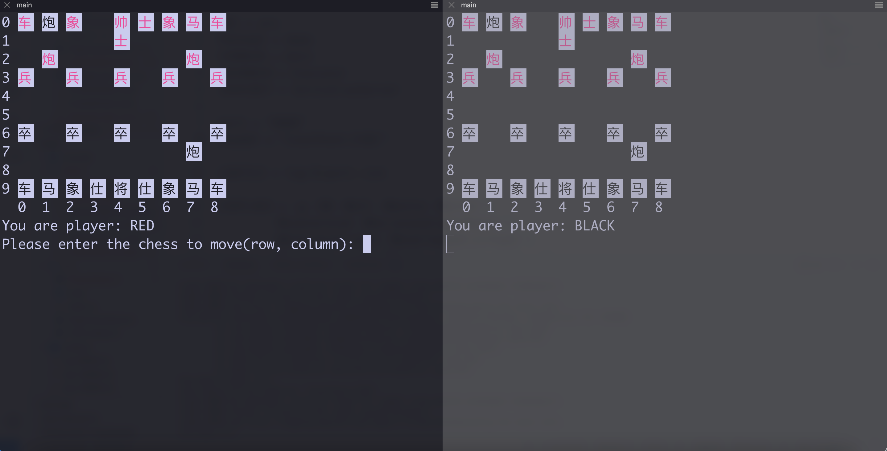

# Chinese Chess Game

About
-----

Implemented by *Java/C++/ZooKeeper*...

Pre-requirement
---------------

* ZooKeeper >= 3.6.3

* g++ >= 4.8.5

* make >= 3.82

* Unix OS: Linux, OSX

Build and Run
-------------

To build and get the executable file:

    % make build

To init the zookeeper server:

    % make init

To start the Client:

    % make run port=<port>

TODO
----

* ZooKeeper-Client shall deal with network problems

* Validity of chess move shall be accessed

* C++ source code could be complied to dynamic libs

* IPC could be encrypted

Demo
----

Starting chess game need at least two clients, just like:

